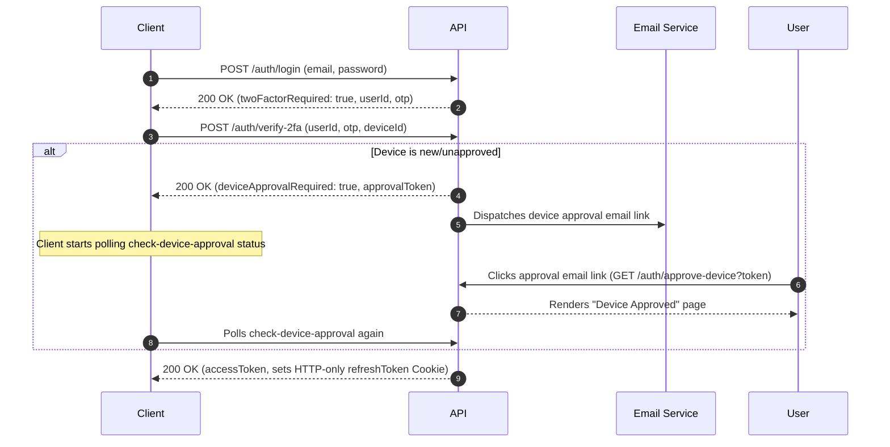

# School Management System - Backend Developer Guide & API Reference

Welcome to the backend developer guide and local API reference for the **School Management System**. This guide provides all necessary technical details for backend developers, frontend developers, and QA engineers working with the application.

---

## 1. Project Overview & Technologies

This backend service is a secure **RESTful API** designed to manage gym memberships, payments, student profiles, customer complaints, customer service call logs, notifications, and analytics dashboards.

### Technology Stack

- **Runtime Environment**: Node.js (v18+)
- **Web Framework**: Express.js (v5.2+)
- **Database**: MongoDB (Atlas) via Mongoose ODM (v9.7+)
- **Authentication & Encryption**: JSON Web Tokens (JWT), Multi-Factor Authentication (OTP), and Bcrypt password hashing
- **File Management**: Multer (disk storage parsing)
- **Security Headers & Limits**: Helmet (HTTP headers protection), Express Rate Limit (DDoS mitigation), Cookie Parser (HTTP-only cookies)
- **Logging**: Morgan (HTTP request logging)

---

## 2. Directory & Folder Structure

```text
school-management-api/
├── BACKEND_GUIDE.md             # This comprehensive guide
├── package.json                 # Dependency manifests & run scripts
├── .env.example                 # Environment variables template
├── src/
│   ├── app.js                   # Express app setup, middlewares, and router mappings
│   ├── server.js                # Server listener, database loader, and uncaught exception handlers
│   ├── models/                  # Mongoose MongoDB schemas
│   │   ├── user.model.js
│   │   ├── student.model.js
│   │   ├── membership-plan.model.js
│   │   ├── membership.model.js
│   │   ├── payment.model.js
│   │   ├── complaint.model.js
│   │   ├── call-log.model.js
│   │   ├── notification.model.js
│   │   ├── reminder-job.model.js
│   │   └── audit-log.model.js
│   ├── routes/                  # Express route mapping endpoints
│   │   ├── auth.routes.js
│   │   ├── user.routes.js
│   │   ├── student.routes.js
│   │   ├── membership-plan.routes.js
│   │   ├── membership.routes.js
│   │   ├── payment.routes.js
│   │   ├── complaint.routes.js
│   │   ├── call-log.routes.js
│   │   ├── notification.routes.js
│   │   ├── dashboard.routes.js
│   │   └── reports.routes.js
│   ├── controllers/             # Express controllers containing business logic
│   ├── middleware/              # Auth protections & Multer upload pipes
│   │   ├── auth.middleware.js
│   │   └── fileUpload.middleware.js
│   ├── validators/              # Joi-style request body validations
│   │   └── auth.validator.js
│   ├── utils/                   # Shared logging, audit loggers, and wrappers
│   │   ├── appError.js          # Unified custom AppError extension
│   │   ├── catchAsync.js        # Controller wrapper to catch async exceptions
│   │   └── auditLogger.js       # Database action logger helper
│   ├── services/                # Notification templates and mock services
│   │   └── email.service.js
│   └── public/                  # Static HTML, CSS, client-side scripts (demo dashboard)
```

---

## 3. Database Models Schema Reference

The system contains **10 core schemas** managed through Mongoose:

### 1. User (`User`)

Represents login credentials, roles, and session security tracking.

- `name` (String, required)
- `email` (String, unique, lowercase, required)
- `password` (String, select: false, minlength: 10, custom regex strength validator)
- `role` (String, enum: `Student`, `CustomerService`, `OperationsManager`, `Admin`, `CEO`)
- `active` (Boolean, default: true)
- `passwordChangedAt` (Date)
- `passwordResetToken`/`passwordResetExpires` (String/Date)
- `twoFactorOTP`/`twoFactorOTPExpires` (String/Date)
- `devices` (Array: `deviceId`, `browserName`, `os`, `ipAddress`, `approved`, `approvalToken`, `approvalTokenExpires`)
- `activeRefreshTokens` (Array: `jti`, `expiresAt`)

### 2. Student (`Student`)

Represents the student profile card. Connected via `email`.

- `name` (String, required)
- `email` (String, required, unique)
- `phone` (String, required)
- `address` (String, required)
- `membership` (String, default: 'None')
- `status` (String, enum: `Active`, `Expiring`, `Expired`, `Inactive`)

### 3. MembershipPlan (`MembershipPlan`)

Pre-configured subscription plan tiers.

- `name` (String, required, unique) - e.g., Basic, Premium, VIP
- `price` (Number, required)
- `duration` (Number, required) - duration in months
- `features` (Array of Strings)
- `active` (Boolean, default: true)

### 4. Membership (`Membership`)

An active student subscription record mapping a profile to a plan.

- `student` (Ref: `Student`, required)
- `plan` (Ref: `MembershipPlan`, required)
- `startDate` (Date, required)
- `endDate` (Date, required)
- `status` (String, enum: `Active`, `Expiring`, `Expired`)

### 5. Payment (`Payment`)

Billing transactions uploaded by students for verification.

- `student` (Ref: `User`, required)
- `studentEmail` (String, required)
- `membershipPlan` (Ref: `MembershipPlan`, required)
- `amount` (Number, required)
- `proofOfPayment` (String, required) - randomized file upload path
- `status` (String, enum: `Pending`, `Approved`, `Rejected`)
- `reviewedBy` (Ref: `User`)
- `reviewedAt` (Date)

### 6. Complaint (`Complaint`)

Customer service feedback tickets raised by students.

- `student` (Ref: `Student`, required)
- `title` (String, required)
- `description` (String, required)
- `assignedStaff` (Ref: `User`)
- `status` (String, enum: `Created`, `Assigned`, `UnderReview`, `Solved`, `Closed`)

### 7. CallLog (`CallLog`)

Log entries documenting CS outbound support interactions.

- `agent` (Ref: `User`, required)
- `student` (Ref: `Student`, required)
- `notes` (String, required)
- `duration` (Number, required) - duration in seconds
- `result` (String, enum: `No Answer`, `Interested`, `Follow-up`, `Joined`, `Upgraded`)

### 8. Notification (`Notification`)

System alerts delivered to user notifications bell.

- `user` (Ref: `User`, required)
- `title` (String, required)
- `message` (String, required)
- `type` (String, enum: `payment_submitted`, `payment_approved`, `payment_rejected`, `membership_expiring`, `membership_expired`, `complaint_updated`, `device_unrecognized`, `device_approved`, `student_risk_alert`)
- `read` (Boolean, default: false)

### 9. ReminderJob (`ReminderJob`)

Pre-scheduled jobs that track when to prompt students for renewals (usually 7 days before expiry).

- `student` (Ref: `Student`, required)
- `membership` (Ref: `Membership`, required)
- `reminderDate` (Date, required)
- `status` (String, enum: `Pending`, `Sent`, `Failed`)

### 10. AuditLog (`AuditLog`)

Immutable security ledger logging administrative changes.

- `user` (Ref: `User`) - who performed the action
- `userEmail` (String)
- `action` (String, required)
- `module` (String, required) - e.g., Auth, Payment, Complaint
- `ipAddress` (String)
- `details` (String)

---

## 4. Authentication Flow



---

## 5. Role-Based Access Control (RBAC) Permissions Matrix

The backend secures routes granularly by checking role allowances defined in `src/config/rbac.config.js`:

| Module          | Action                  | Student | CustomerService | OperationsManager | Admin | CEO |
| :-------------- | :---------------------- | :-----: | :-------------: | :---------------: | :---: | :-: |
| **users**       | read / write            |   ❌    |       ❌        |        ❌         |  ✅   | ✅  |
| **students**    | read / write            |   own   |       ✅        |        ✅         |  ✅   | ✅  |
| **memberships** | read / write            |   own   |       ✅        |        ✅         |  ✅   | ✅  |
| **payments**    | create / read / approve |   own   | read / approve  |       read        | read  | ✅  |
| **complaints**  | create / read / update  |   own   |       ✅        |       read        | read  | ✅  |
| **call-logs**   | create / read           |   ❌    |       ✅        |       read        | read  | ✅  |
| **reports**     | read / sync             |   ❌    |       ❌        |        ❌         | read  | ✅  |
| **dashboard**   | read                    |   ❌    |       ✅        |        ✅         |  ✅   | ✅  |

_Note: `own` restricts resource filters programmatically so students can only view or query their own records._

---

## 6. Local API Endpoints Reference

### 🔐 Auth Endpoints

#### Login

- **Endpoint**: `POST http://localhost:5000/api/v1/auth/login`
- **Request Body**:
  ```json
  {
    "email": "student@example.com",
    "password": "P@ssword123!"
  }
  ```
- **Success Response (200)**:
  ```json
  {
    "status": "success",
    "message": "OTP sent to email. Please verify 2FA.",
    "twoFactorRequired": true,
    "userId": "6a5b24325aac955ace911c9f",
    "email": "student@example.com",
    "otp": "612773"
  }
  ```

#### Verify 2FA & Device Recognition

- **Endpoint**: `POST http://localhost:5000/api/v1/auth/verify-2fa`
- **Request Body**:
  ```json
  {
    "userId": "6a5b24325aac955ace911c9f",
    "otp": "612773",
    "deviceId": "client_browser_uuid_100"
  }
  ```
- **Response (If approved device, 200)**:
  _Sets HTTP-only Cookie `refreshToken`_
  ```json
  {
    "status": "success",
    "accessToken": "eyJhbGciOiJIUzI1NiIsIn...",
    "data": {
      "user": {
        "_id": "6a5b24325aac955ace911c9f",
        "name": "Student User",
        "email": "student@example.com",
        "role": "Student"
      }
    }
  }
  ```
- **Response (If unrecognized device, 200)**:
  ```json
  {
    "status": "success",
    "deviceApprovalRequired": true,
    "userId": "6a5b24325aac955ace911c9f",
    "deviceId": "client_browser_uuid_100",
    "approvalToken": "4a9dbcf887cbcc307bff12...",
    "message": "Device approval required. An email has been sent to verify this device."
  }
  ```

#### Check Device Status (Polling)

- **Endpoint**: `POST http://localhost:5000/api/v1/auth/check-device-approval`
- **Request Body**:
  ```json
  {
    "userId": "6a5b24325aac955ace911c9f",
    "deviceId": "client_browser_uuid_100"
  }
  ```
- **Response (Approved, 200)**:
  _Sets rotated `refreshToken` Cookie_
  ```json
  {
    "status": "success",
    "accessToken": "eyJhbGciOiJIUzI1NiIsIn..."
  }
  ```

#### Rotate Refresh Token

- **Endpoint**: `POST http://localhost:5000/api/v1/auth/refresh-token`
- **Headers**: Cookie `refreshToken=...` must be attached
- **Response (Success, 200)**:
  _Sets new rotated `refreshToken` Cookie_
  ```json
  {
    "status": "success",
    "accessToken": "eyJhbGciOiJIUzI1NiIsIn..."
  }
  ```
- **Response (Reuse Detected, 401)**:
  ```json
  {
    "status": "fail",
    "message": "Potential token reuse detected. All sessions have been revoked. Please log in again."
  }
  ```

---

### 💳 Payments & Receipts Upload

#### Upload Proof

- **Endpoint**: `POST http://localhost:5000/api/v1/payments/upload-proof`
- **Headers**: `Authorization: Bearer <accessToken>`
- **Request Body (Multipart Form-Data)**:
  - `membershipPlanId`: `6a5b19be41dbc2edf7062c88`
  - `proof`: File attachment (e.g. proof.png)
- **Response (Success, 201)**:
  ```json
  {
    "status": "success",
    "data": {
      "payment": {
        "student": "6a5b24325aac955ace911c9f",
        "studentEmail": "student@example.com",
        "membershipPlan": "6a5b19be41dbc2edf7062c88",
        "proofOfPayment": "src/uploads/proofs/845cd599-50ce-43dd-8333-ba2686747aa9.png",
        "amount": 50,
        "status": "Pending"
      }
    }
  }
  ```

---

### ⚠️ Complaints

#### File Complaint

- **Endpoint**: `POST http://localhost:5000/api/v1/complaints`
- **Headers**: `Authorization: Bearer <accessToken>`
- **Request Body**:
  ```json
  {
    "title": "Cold Showers",
    "description": "The showers in the locker room have no hot water."
  }
  ```
- **Response (Success, 201)**:
  ```json
  {
    "status": "success",
    "data": {
      "complaint": {
        "_id": "6a5b678c12a832bc998aa90a",
        "student": "6a5b24325aac955ace911c9f",
        "title": "Cold Showers",
        "description": "The showers in the locker room have no hot water.",
        "status": "Created"
      }
    }
  }
  ```

---

### 📊 Dashboard & Reports

#### Dashboard stats

- **Endpoint**: `GET http://localhost:5000/api/v1/dashboard/stats`
- **Headers**: `Authorization: Bearer <accessToken>`
- **Response (Success, 200)**:
  ```json
  {
    "status": "success",
    "data": {
      "metrics": {
        "totalStudents": 15,
        "activeMembers": 10,
        "pendingPayments": 1,
        "monthlyRevenue": 500
      },
      "complaints": {
        "Created": 1,
        "Assigned": 0,
        "UnderReview": 0,
        "Solved": 0,
        "Closed": 0,
        "total": 1
      },
      "csPerformance": {
        "calls": { "No Answer": 0, "Interested": 2, "Joined": 1, "total": 3 },
        "avgCallDuration": 120
      },
      "highRiskStudents": [
        {
          "name": "Student User",
          "email": "student@example.com",
          "riskLevel": "High",
          "riskDetails": {
            "score": 65,
            "factors": ["Pending Payment", "Open Complaint"]
          }
        }
      ]
    }
  }
  ```

---

## 7. Frontend Integration & Client-Side Code Snippets

Here is copy-pasteable JavaScript code that frontend developers can use to interact with the backend API.

### Core API Client (With Auto-Refresh & Credentials Support)

This helper automatically injects the `Authorization` header, handles cross-origin cookie credentials, monitors for `401` errors, calls the token rotation endpoint, updates state, and retries the request seamlessly.

```javascript
// client.js
let accessToken = null; // Store in memory only for XSS protection

const BASE_URL = "http://localhost:5000/api/v1";

async function apiRequest(
  endpoint,
  method = "GET",
  body = null,
  isMultipart = false,
) {
  const headers = {};

  // Attach Access Token if available
  if (accessToken) {
    headers["Authorization"] = `Bearer ${accessToken}`;
  }

  // Set JSON content-type if not uploading file
  if (!isMultipart && body) {
    headers["Content-Type"] = "application/json";
  }

  const options = {
    method,
    headers,
    credentials: "include", // CRITICAL: Tells browser to include cookies (refresh token)
  };

  if (body) {
    options.body = isMultipart ? body : JSON.stringify(body);
  }

  const response = await fetch(`${BASE_URL}${endpoint}`, options);

  // Handle unauthorized / expired access token (Auto-refresh)
  if (response.status === 401 && endpoint !== "/auth/refresh-token") {
    console.warn("Access token expired. Attempting token rotation...");
    const refreshSuccess = await refreshAccessToken();
    if (refreshSuccess) {
      // Retry original request with new token
      return apiRequest(endpoint, method, body, isMultipart);
    } else {
      // Direct user to login page
      window.dispatchEvent(new Event("logout-user"));
      throw new Error("Session expired. Please log in again.");
    }
  }

  const data = await response.json();
  if (!response.ok) {
    throw new Error(data.message || "API request failed");
  }

  return data;
}

// Token Rotation Helper
async function refreshAccessToken() {
  try {
    const res = await fetch(`${BASE_URL}/auth/refresh-token`, {
      method: "POST",
      credentials: "include",
    });
    if (res.ok) {
      const data = await res.json();
      accessToken = data.accessToken; // Save new access token in memory
      return true;
    }
    return false;
  } catch (err) {
    console.error("Failed to rotate refresh token:", err);
    return false;
  }
}
```

### Flow 1: Register and Login (MFA + Device Approval)

```javascript
// 1. Initial Login Request
async function loginUser(email, password) {
  try {
    const res = await apiRequest("/auth/login", "POST", { email, password });
    if (res.twoFactorRequired) {
      console.log("OTP Code generated (Local Dev):", res.otp);
      return { twoFactorRequired: true, userId: res.userId };
    }
  } catch (err) {
    alert(`Login failed: ${err.message}`);
  }
}

// 2. Complete 2FA Login and poll if browser is unrecognized
async function verify2FA(userId, otp, deviceId) {
  try {
    const res = await apiRequest("/auth/verify-2fa", "POST", {
      userId,
      otp,
      deviceId,
    });

    if (res.deviceApprovalRequired) {
      alert(
        "Unrecognized browser detected. Please check your email for the approval link.",
      );
      // Start polling for approval status
      startDevicePolling(userId, deviceId);
      return { pendingApproval: true };
    }

    accessToken = res.accessToken; // Logged in!
    return { loginSuccess: true };
  } catch (err) {
    alert(`Verification failed: ${err.message}`);
  }
}

// 3. Device Approval Status Polling
function startDevicePolling(userId, deviceId) {
  const interval = setInterval(async () => {
    try {
      const res = await apiRequest("/auth/check-device-approval", "POST", {
        userId,
        deviceId,
      });
      if (res.status === "success") {
        clearInterval(interval);
        accessToken = res.accessToken; // Logged in!
        alert("Device approved! You have been logged in.");
        window.location.reload(); // Redirect to home
      }
    } catch (err) {
      // Continue polling silently if still pending
    }
  }, 3000);
}
```

### Flow 2: Upload Proof of Payment (Multipart + Security Scanner)

```javascript
async function uploadPaymentProof(membershipPlanId, fileObject) {
  const formData = new FormData();
  formData.append("membershipPlanId", membershipPlanId);
  formData.append("proof", fileObject); // File attachment input

  try {
    const res = await apiRequest(
      "/payments/upload-proof",
      "POST",
      formData,
      true,
    );
    alert(
      "Proof uploaded successfully! Path: " + res.data.payment.proofOfPayment,
    );
  } catch (err) {
    alert(`Upload rejected: ${err.message}`);
    // Captures file size limit errors, extension restrictions, and malware scan failures
  }
}
```

### Flow 3: Submit Support Complaint

```javascript
async function fileSupportTicket(title, description) {
  try {
    const res = await apiRequest("/complaints", "POST", { title, description });
    alert(
      `Ticket #${res.data.complaint._id} created! Status: ${res.data.complaint.status}`,
    );
  } catch (err) {
    alert(`Failed to file complaint: ${err.message}`);
  }
}
```

### Flow 4: Load CS Dashboard Stats

```javascript
async function loadDashboardStats() {
  try {
    const res = await apiRequest("/dashboard/stats", "GET");
    console.log("Metrics:", res.data.metrics);
    console.log(
      "Priority Support Queue (Sorted by Risk):",
      res.data.highRiskStudents,
    );
  } catch (err) {
    console.error("Failed to load stats:", err.message);
  }
}
```

---

## 8. Cron Jobs & Expiring Subscriptions Checks

Rather than running a persistent scheduling engine (like `node-cron`) during local development, subscription lifecycle evaluations are simulated on-demand:

- **Simulate Route**: `POST http://localhost:5000/api/v1/memberships/simulate-expiry`
- **Trigger Access**: Requires CS Agent, Admin, or CEO token credentials.
- **Actions Performed**:
  - Sets memberships with past-due endDates to `Expired`.
  - Sets corresponding Student profile statuses to `Expired`.
  - Raises `membership_expired` in-app notifications.
  - Sends mock alert emails.
  - Evaluates student risk levels, triggering notifications to the Operations Manager and CS Agents if risk flags hit High or Critical.

---

## 9. Environment Configuration

Copy `.env.example` into a local `.env` file in the root directory:

```env
PORT=5000
NODE_ENV=development
MONGO_URI=mongodb+srv://<username>:<password>@cluster.mongodb.net/school-management
JWT_SECRET=super-secret-access-key-should-be-long-and-random
JWT_REFRESH_SECRET=super-secret-refresh-key-should-be-long-and-random
TOKEN_EXPIRE=15m
REFRESH_EXPIRE=7d
CORS_ORIGIN=*
```

---

## 10. Developer Verification Checklists

### 🧪 Automated Tests Suite

Verify changes programmatically using verification scripts saved in the `scratch/` directory:

- **Refresh Token Rotation & MFA device approval**:
  `node scratch/test_security_flows.js`
- **Secure uploads, extension whitelist & virus scan**:
  `node scratch/test_secure_upload.js`
- **Password Strength Rules check**:
  `node scratch/test_password_strength.js`
- **CS & Operations Manager student risk alerts**:
  `node scratch/test_risk_notifications.js`

### 📋 Manual API Security Checklist

- [ ] **Verify Authentication**: Try accessing `/dashboard/stats` without headers. Should fail with `401`.
- [ ] **Verify Password Constraints**: Try registering a user with password `password123`. Request should fail with `400` details.
- [ ] **Verify Upload Integrity**: Attempt uploading `trojan.exe` to `/payments/upload-proof`. Multer should reject it.
- [ ] **Verify Threat Scanner**: Attempt uploading a text file containing the word `malware` as payment proof. Should return `400 Virus scan failed` and delete the file.
- [ ] **Verify Privilege Escalation**: Log in as a Student and attempt to hit GET `/users` (admin only). Verify it returns `403 Forbidden`.
